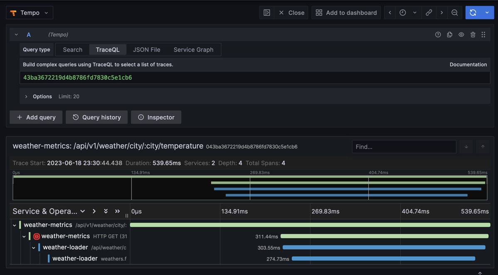

# weather-documentation

Documentación de los servicios del TP Final Arquitectura 2 (openweathermap)

### Docker compose template

Se tomó de modelo este repositorio:
https://github.com/Einsteinish/Docker-Compose-Prometheus-and-Grafana

## Inicializar servicios

### Prerequisitos:

- Bash
- Git
- Docker
- Docker-compose
- MongoCLI y DB (opcional)

### Instrucciones

1. Clonar el presente repositorio y ejecutar los siguientes pasos dentro de este.

`git clone https://github.com/unq-arq2-ecommerce-team/weather-documentation.git`

`cd ./weather-documentation`

2. Modificar las envs de "./envs/env-{servicio}.env" de cada servicio con los datos correspondientes.

Recomendacion: Cambiar en envs "localhost" con "servicio". Ejemplo:

products-orders-service recomendacion al usar docker-compose:

```
    WEATHER_CURRENT_TEMP_URL=http://weather-loader-component:8081/api/weather/city/{city}/temperature
```

3. Ejecutar el script runServices.sh que ejecuta el docker-compose.yml (si no se ejecuto el paso 2, se pueden pasar el flag -c o --clone para clonar todos los repos, el script borra los directorios clonados si se selecciona esa opcion)

Dar permisos al script:

    ```chmod +X ./runServices.sh```

Sin limpiar ni clonar repos

    ```./runServices.sh```

Limpiar y clonar repos

    ```./runServices.sh --clone```

4. Una vez levantados todos los containers, dirigirse a http://localhost:3000

5. Loggear con las credenciales: `admin / admin`

### Test de carga y métricas

En la carpeta artillery se encuentran archivos para ejecutar para los tests de carga, es necesario instalar als dependencias y además artillery de forma global para ejercutarlos por comando.

```bash
npm install -g artillery
npm install
artillery run artiller/file.yml
```

# Implementación Estrategias de Observabilidad
 
Varias de las estrategias se implementaron con [Prometheus](https://prometheus.io/) y [Grafana](https://grafana.com/).

- **Prometheus**: Sistema de monitoreo de código abierto. Recopila métricas de distintos lugares con técnica de "scrape" y las almacena en una base de datos de series de tiempo. 
- **Grafana**: Herramienta de visualización de datos de código abierto. Utiliza Prometheus como fuente de datos.

## Log aggregation

Implementado con [Loki](https://grafana.com/oss/loki/) + Grafana.

**Loki**: es como Prometheus pero para logs. Recolecta logs de distintos lugares y los almacena en una base de datos de series de tiempo.

En nuestro caso enviamos los logs directamente a Loki desde los servicios utilizando un "hook" de logrus.

## Metrics aggregation

Implementado con Prometheus + cAdvisor + node-exporter + Grafana.

**cAdvisor**: Recolecta métricas de los contenedores de Docker.

**node-exporter**: Recolecta métricas del Docker host.

Para las métricas de los Weather services, se envían directamente a Prometheus desde los servicios mediante un middleware.

## Distributed tracing 

Implementado con libs de [OpenTelemetry](https://opentelemetry.io/) para Go + OTel Collector + [Grafana Tempo](https://grafana.com/docs/tempo/latest/).

**OpenTelemetry**: También conocido como OTel. Su objetivo es proveer un set de herramientas, APIs y librerías para enviar métricas a un backend de observabilidad.


**Grafana Tempo**: Es un backend de trazas distribuido de código abierto. Soporta protocolos de trazas como Jaeger, Zipkin, y OpenTelemetry. 




## Alerting

Implementado con Prometheus + Blackbox Exporter + Alertmanager.

**Blackbox Exporter**: Permite "sondear" distintos servicios utilizando HTTP, HTTPS, DNS, TCP y ICMP.
**Alertmanager**: Recibe alertas de Prometheus, las gestiona, y las envía a distintos canales (Slack, email, Webhooks, etc).

Configuramos un "scrape" de Blackbox en Prometheus para que sondee los servicios del Tiempo (hacer un GET de healthcheck). 
En caso de no responder, se dispara una alerta en Prometheus.
La alerta llega a Prometheus y es administrada por Alertmanager, que tiene configurado un webhook para enviar las alertas a Discord.
Cada vez que se dispara una alerta (o hay una recuperación), se envía un mensaje al canal de Discord


