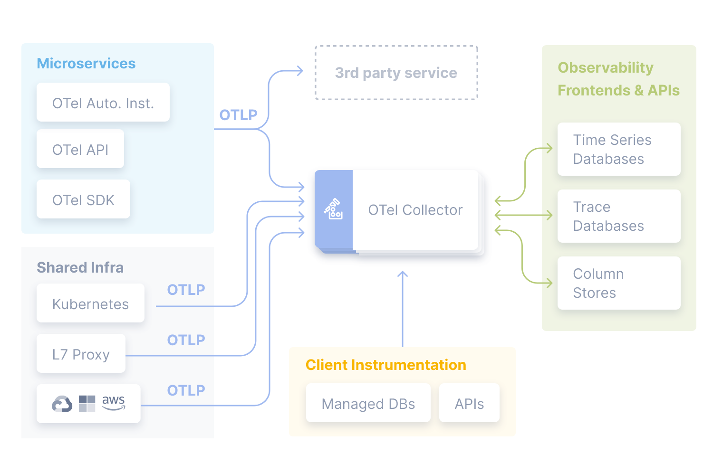
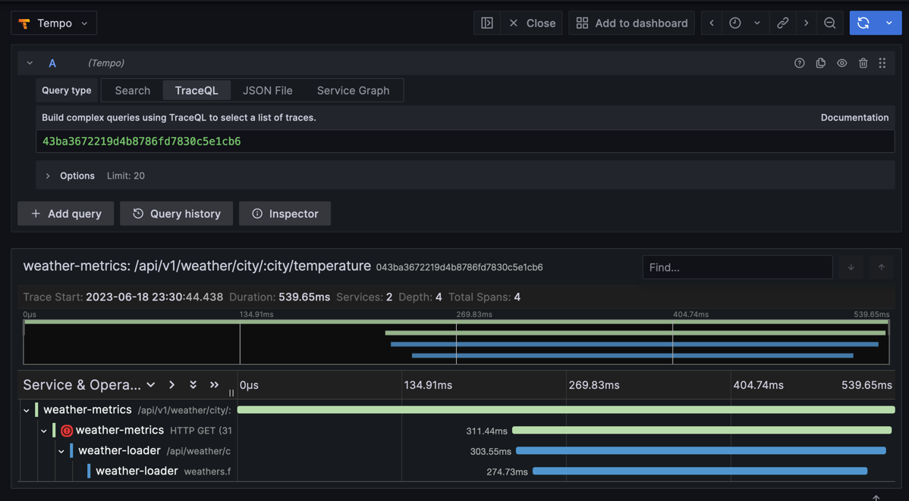
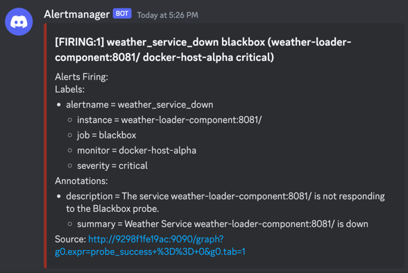

# Documentación

[Enunciado del Trabajo Practico](./assets/enunciadoTP_Final_2023s1.pdf)

# Implementación Estrategias de Observabilidad
 
Varias de las estrategias se implementaron con [Prometheus](https://prometheus.io/) y [Grafana](https://grafana.com/).

- **Prometheus**: Sistema de monitoreo de código abierto. Recopila métricas de distintos lugares con técnica de "scrape" y las almacena en una base de datos de series de tiempo. 
- **Grafana**: Herramienta de visualización de datos de código abierto. Utiliza Prometheus como fuente de datos.

## Log aggregation

Implementado con [Loki](https://grafana.com/oss/loki/) + [Promtail](https://grafana.com/docs/loki/latest/clients/promtail/) + Grafana.

**Loki**: es como Prometheus pero para logs. Recolecta logs de distintos lugares y los almacena en una base de datos de series de tiempo.
**Promtail**: Agente de recolección de logs para enviar a Loki.

## Metrics aggregation

Implementado con Prometheus + cAdvisor + node-exporter + Grafana.

**cAdvisor**: Recolecta métricas de los contenedores de Docker.

**node-exporter**: Recolecta métricas del Docker host.

Para las métricas de los Weather services, se envían directamente a Prometheus desde los servicios mediante un middleware.

## Distributed tracing 

Implementado con libs de [OpenTelemetry](https://opentelemetry.io/) para Go + OTel Collector + [Grafana Tempo](https://grafana.com/docs/tempo/latest/).

**OpenTelemetry**: También conocido como OTel. Su objetivo es proveer un set de herramientas, APIs y librerías para enviar métricas a un backend de observabilidad.

**Grafana Tempo**: Es un backend de trazas distribuido de código abierto. Soporta protocolos de trazas como Jaeger, Zipkin, y OpenTelemetry. 

## Alerting

Implementado con Prometheus + Blackbox Exporter + Alertmanager.

**Blackbox Exporter**: Permite "sondear" distintos servicios utilizando HTTP, HTTPS, DNS, TCP y ICMP.
**Alertmanager**: Recibe alertas de Prometheus, las gestiona, y las envía a distintos canales (Slack, email, Webhooks, etc).

Configuramos un "scrape" de Blackbox en Prometheus para que sondee los servicios del Tiempo (hacer un GET de healthcheck). 
En caso de no responder, se dispara una alerta en Prometheus.
La alerta llega a Prometheus y es administrada por Alertmanager, que tiene configurado un webhook para enviar las alertas a Discord.
Cada vez que se dispara una alerta (o hay una recuperación), se envía un mensaje al canal de Discord

