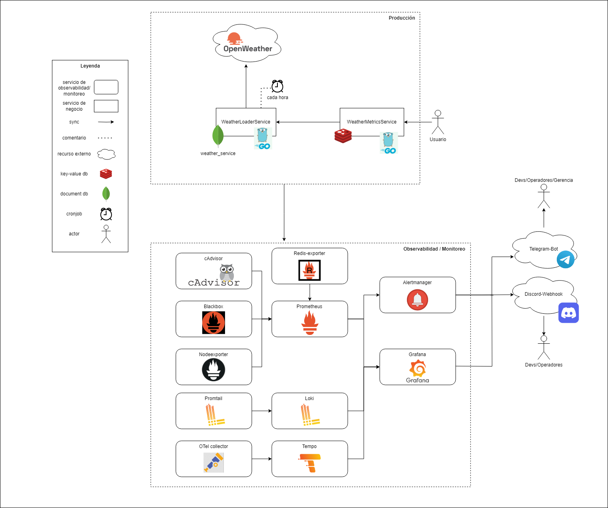
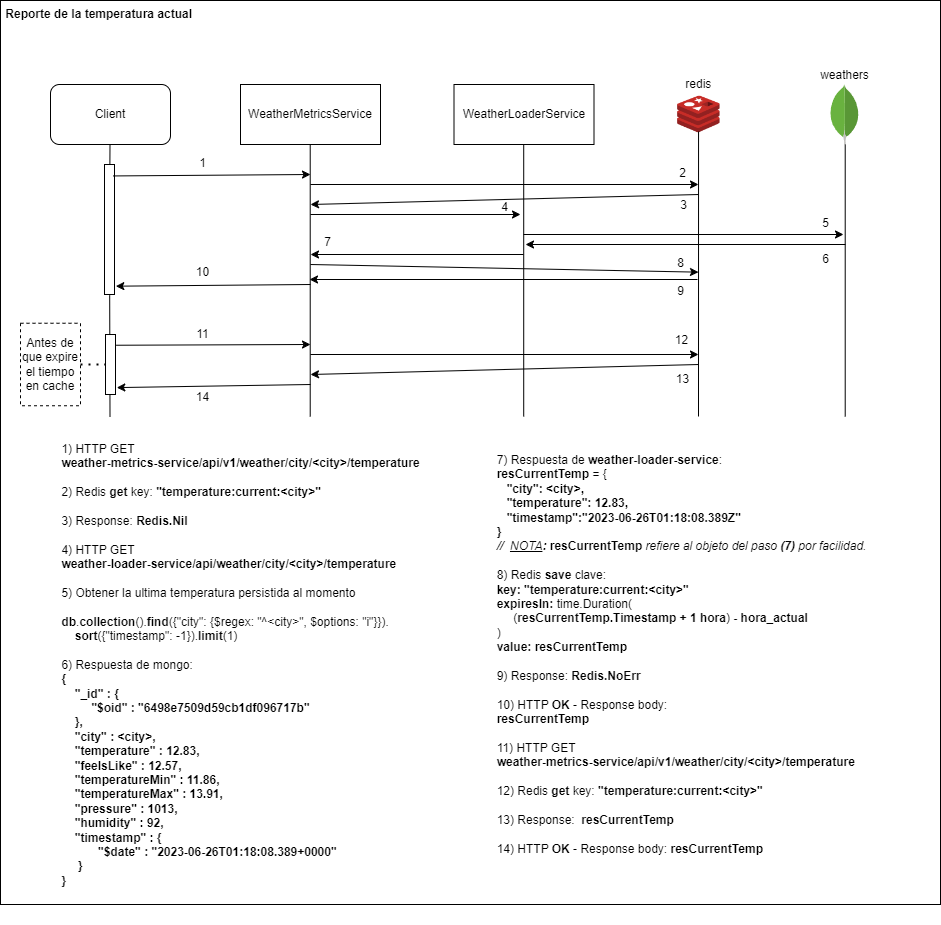
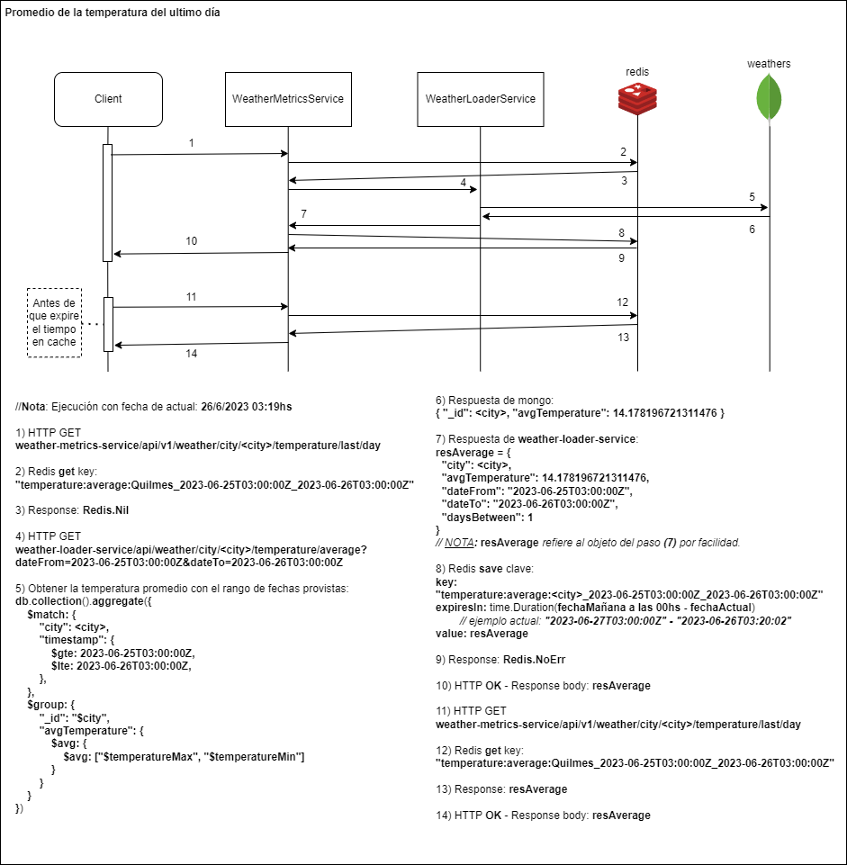

# Documentación

## Enunciado

[Enunciado del Trabajo Practico](./assets/enunciadoTP_Final_2023s1.pdf)

## Reporte de documentación

(!!!Actualizar a version final!!!)
[Reporte de documentación Beta](./assets/TP_Final_Documentacion_vBeta.pdf)

## Grafana - Guia configuracion alerta para el apdex

[Guia configuracion alerta para el apdex en Grafana](./grafana_alerta_config)

[Directo al README](./grafana_alerta_config/README.md)

## Diagrama de arquitectura

## Diagrama de Secuencias

### Reporte de temperatura actual

### Temperatura promedio del ultimo día

Nota: Este caso es identico al de la semana, solo cambiando el rango de fechas de un dia a una semana.