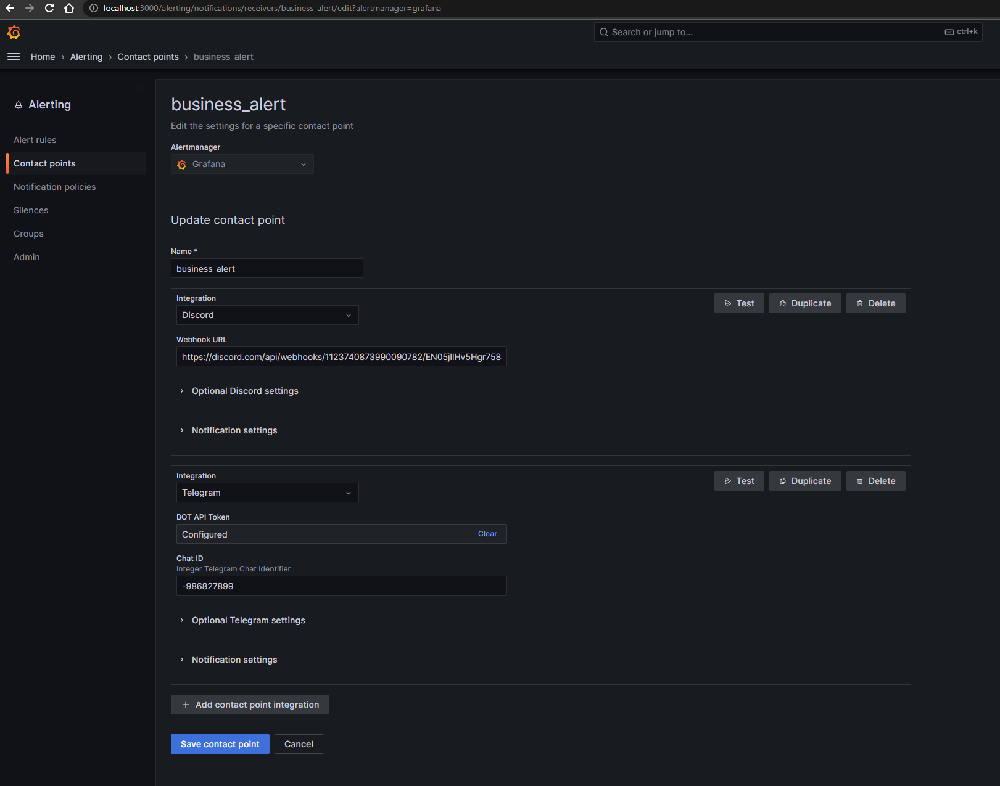
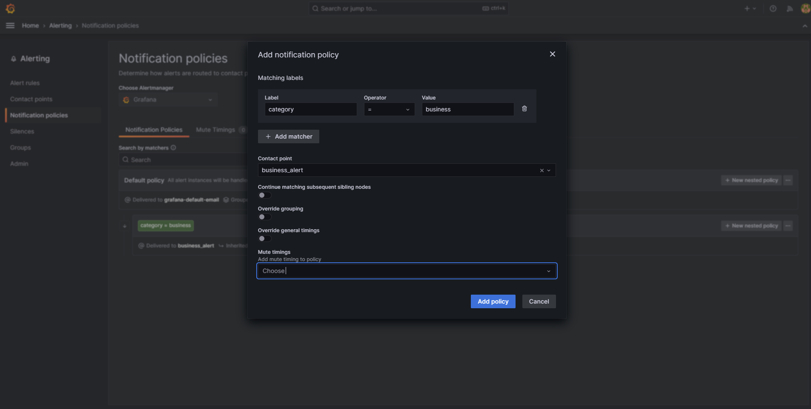
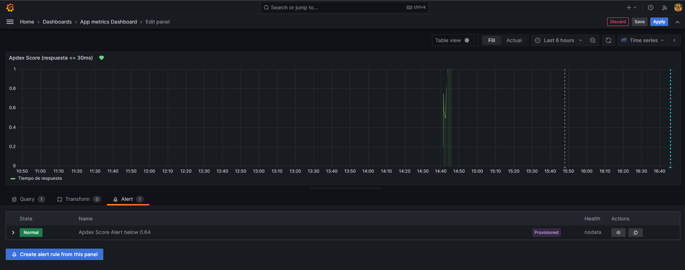
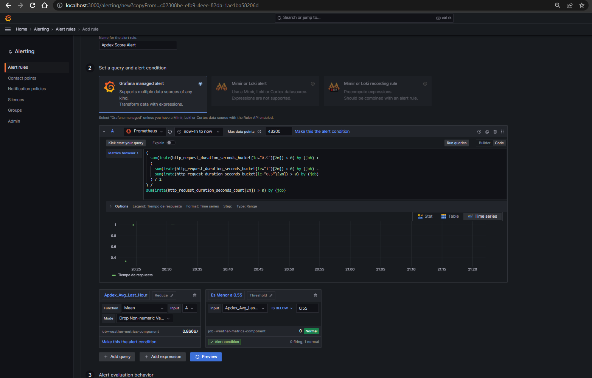
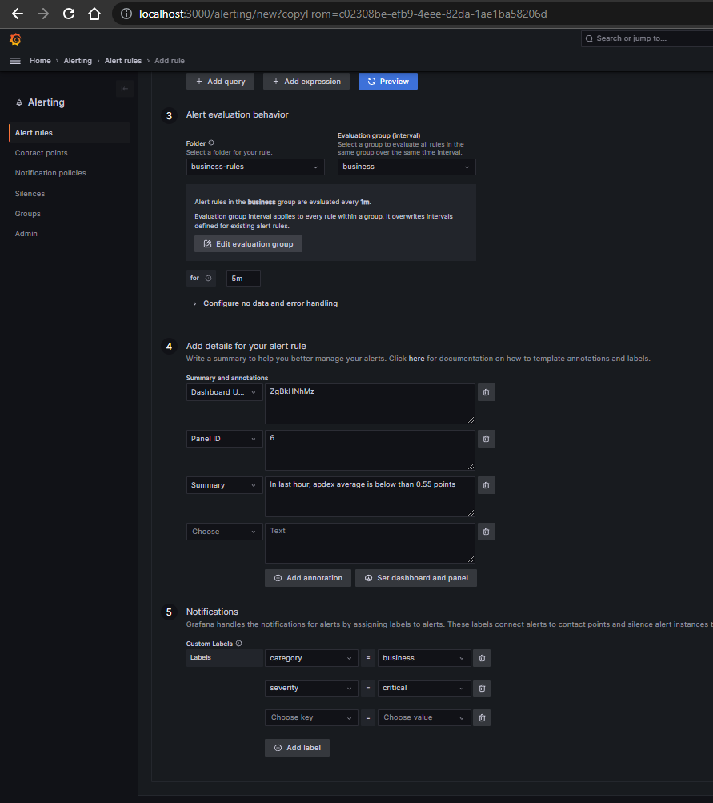

## Grafana - Guia configuracion alerta para el apdex

Sirve principalmente para la alerta apdex, pero cambiando algunos campos puede servir para cualquier otra. Tambien se puede dirigir al dashboard deseado y generar la alerta desde ahi.

Se realizó esta guia por la dificultad que se encuentra de editar y/o eliminar alertas importadas.

### 1) Configurar Contact Points

["alermanager/config.yaml"](../../alertmanager/config.yml)

    A) Integracion con discord:
        
        - Webhook URL: https://discord.com/api/webhooks/1123740873990090782/EN05jIlHv5Hgr7588-R20fis2GPoqteCTq4aS3kvE4oL4SgMnj9dqODhGxivLIc_0usk
    
    B) Integracion con telegram: (revisar en "alermanager/config.yaml" en el conjunto de claves en "telegram_receiver")

        - BOT API Token: (en "telegram_receiver" campo "bot_token")
        - Chat ID: (en "telegram_receiver" campo "chat_id")
        - Message: (en "telegram_receiver" campo "message")




### 2) Configurar Notification policies con los valores que se encuentran en la imagen de debajo:




### 3) Una vez que tenemos los receptores y su handleos de alertas configurados. Vamos a cargar las reglas de alertas, dirigiendonos al dashboard deseado, le damos a editar, luego vamos al tab "alert", le damos a crear al boton "Create alert rule from this panel" (cuidado: no todo dashboard puede aplicar, y tirara un error):





### 4) Luego dentro pondremos la query deseada con sus opciones (si es el apdex, se pueden utilizar los datos provistos en texto como en imagenes, sino revisar que datos se desean):

```
(
  sum(rate(http_request_duration_seconds_bucket{le="0.5"}[2m])) by (job) +
  (
    sum(rate(http_request_duration_seconds_bucket{le="1"}[2m])) by (job) - 
    sum(rate(http_request_duration_seconds_bucket{le="0.5"}[2m])) by (job)
  ) / 2
) / 
sum(rate(http_request_duration_seconds_count[2m])) by (job)

```

Nota: desestimar el "irate" y "> 0" en la query en la imagen, ya que con un filtro te los elimina.



En el paso (4) de crear la alerta, agregar el annotation "Summary" con el siguiente texto:

```text
In last hour, apdex average is below than minimum points
```

Luego en el paso (5) de crear la alerta, se debe agregar los "Labels" (si es apdex, sino a eleccion):
 - category = business
 - severity = critical

